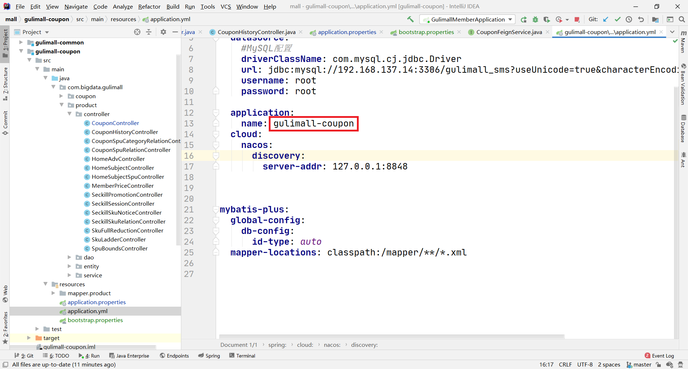

# 修改了虚拟机的IP地址


# 19、快速开发-逆向生成所有微服务基本CRUD代码.avi

http://localhost:7000/coupon/coupon/list

http://localhost:8000/member/growthchangehistory//list

http://localhost:9000/order/order/list

http://localhost:10000/product/attrattrgrouprelation/list

http://localhost:11000/ware/purchase/list

# nacos

http://localhost:8848/nacos

# 远程调用

http://localhost:8000/member/member/coupons

遇到的错误：Spring Cloud Service id not legal hostname

[解决方法](https://blog.csdn.net/weistin/article/details/103720627)：Feign的服务名不能使用下划线，需使用短杠，即：“aa-bb”

相关的六个文件如下：


# 读取配置文件application.properties

http://localhost:7000/coupon/coupon/test

三个相关文件


# 配置中心

## 配置方法

一般是 `name.properties`

```
gulimall-coupon.properties
```



## 在配置中心发布


## @RefreshScope


## 访问

http://localhost:7000/coupon/coupon/test


