# 安装软件

## VirtualBox-6.0.12-133076-Win

记得更改存储位置

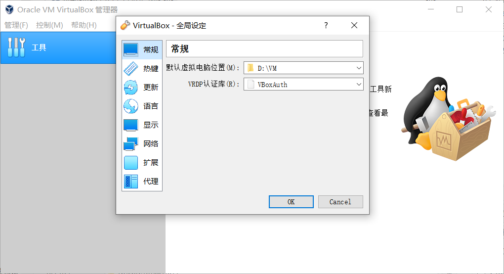

## vagrant_2.2.5_x86_64.msi

安装完毕需要重启，点击 yes

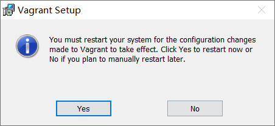

### 安装成功验证

cmd 输入 

```shell
vagrant 
```


# 虚拟环境搭建

## 初始化

```shell
vagrant init centos/7
```

## 镜像安装

### 在线下载

不建议使用这个，下载起来太慢了建议使用下面的`本地导入`

```
vagrant up
```

### 本地导入

```shell
::vagrant box add centos/7 路径
::例如：
vagrant box add centos/7 D:\core\资源\软件\CentOS-7-x86_64-Vagrant-1905_01.VirtualBox.box
```

## 开启SSH，并登陆到centos7

### 启动

```shell
vagrant up
```

### 登陆

`ctrl+c` 停止，然后输入：

```shell
vagrant ssh
```

### 成功验证

```
whoami
ls /
exit

```

## 配置网络信息

### 配置

打开"Vagrantfile"文件

```shell
config.vm.network "private_network", ip: "192.168.56.10"
```

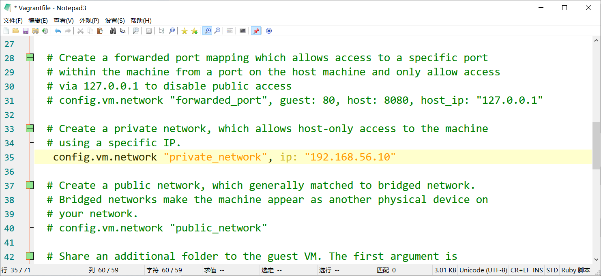

### 重启

```
vagrant reload
```

### 查看配置

```
vagrant ssh
```

```
ip addr
```

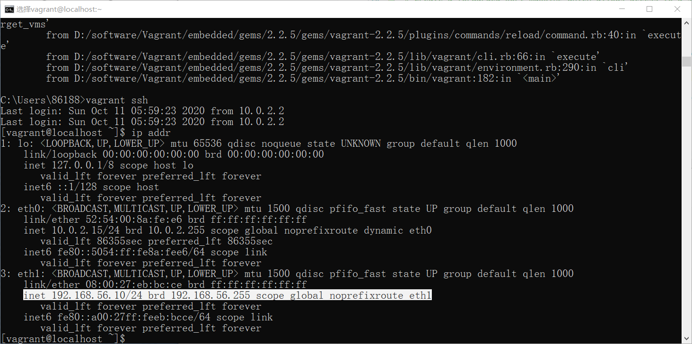

### ping

#### 本机 ping 虚拟

```
ping 192.168.56.10
```

#### 虚拟 ping 本机

查看本机 ip 地址

```
ipconfig
```

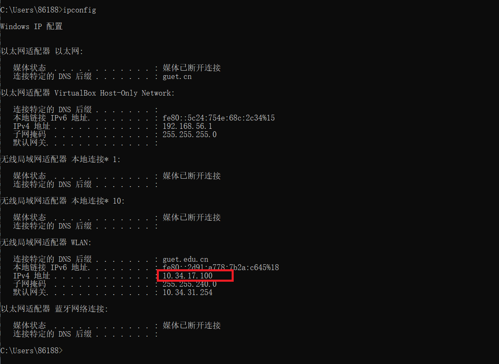

```
ping 10.34.17.100
```

# 安装 docker

```
sudo yum remove docker \
                  docker-client \
                  docker-client-latest \
                  docker-common \
                  docker-latest \
                  docker-latest-logrotate \
                  docker-logrotate \
                  docker-engine
```

```
sudo yum install -y yum-utils
```

```
sudo yum-config-manager \
    --add-repo \
    https://download.docker.com/linux/centos/docker-ce.repo
```

```
sudo yum install docker-ce docker-ce-cli containerd.io
```

## 启动

```
sudo systemctl start docker
```

## 成功验证

### 版本查看

```
docker -v
```

### 检查镜像

```
sudo docker images
```

## 开机自启动

```
sudo systemctl enable docker
```

## 加速

```
sudo mkdir -p /etc/docker
sudo tee /etc/docker/daemon.json <<-'EOF'
{
  "registry-mirrors": ["https://6ypv0a1a.mirror.aliyuncs.com"]
}
EOF
sudo systemctl daemon-reload
sudo systemctl restart docker
```

## 安装

### mysql

#### 安装

```
sudo docker pull mysql:5.7
```

#### 检查

```
sudo docker images
```

#### 启动

```shell
sudo docker run -p 3306:3306 --name mysql \
-v /mydata/mysql/log:/var/log/mysql \
-v /mydata/mysql/data:/var/lib/mysql \
-v /mydata/mysql/conf:/etc/mysql \
-e MYSQL_ROOT_PASSWORD=root \
-d mysql:5.7
```

#### 查看正在运行

```
sudo docker ps
```

#### 连接测试

密码： root

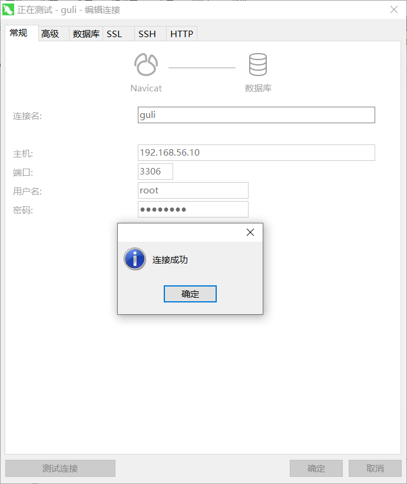

### redis

#### 安装

```
sudo docker pull redis
```

#### 配置

```
sudo mkdir -p /mydata/redis/conf
cd /mydata/
sudo touch /mydata/redis/conf/redis.conf

sudo echo "appendonly yes"  >> sudo /mydata/redis/conf/redis.conf

sudo docker run -p 6379:6379 --name redis -v /mydata/redis/data:/data \
 -v /mydata/redis/conf/redis.conf:/etc/redis/redis.conf \
 -d redis redis-server /etc/redis/redis.conf
```

#### 测试

```
sudo docker exec -it redis redis-cli
```

```

set key1 v1
get key1
```

#### 开机自启动

```
sudo docker update redis --restart=always
```

##### 测试

```
sudo docker start redis
```

```
sudo docker exec -it redis redis-cli
```

# 常用

```
cd C:\Users\86188

vagrant up

vagrant ssh
```

```
sudo docker images
```

```
sudo docker ps
```

```
sudo docker start redis
```

```
sudo docker start mysql
```


# 1：renren-fast 测试

## 导入数据库

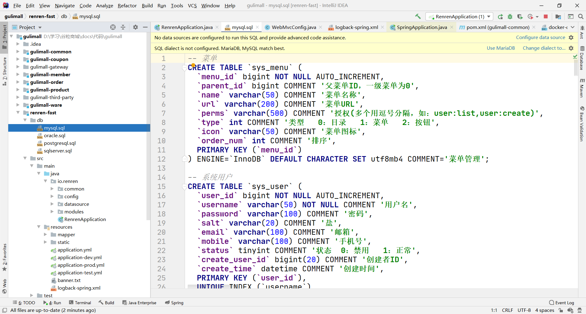

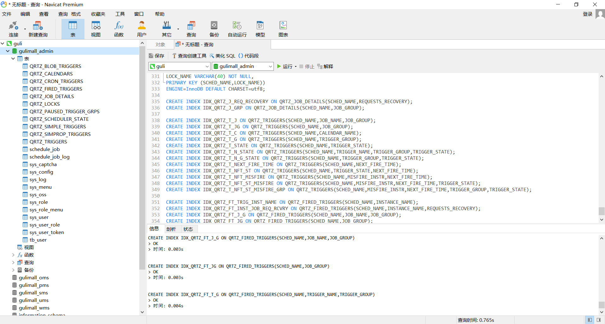

## 访问

http://localhost:8080/renren-fast/

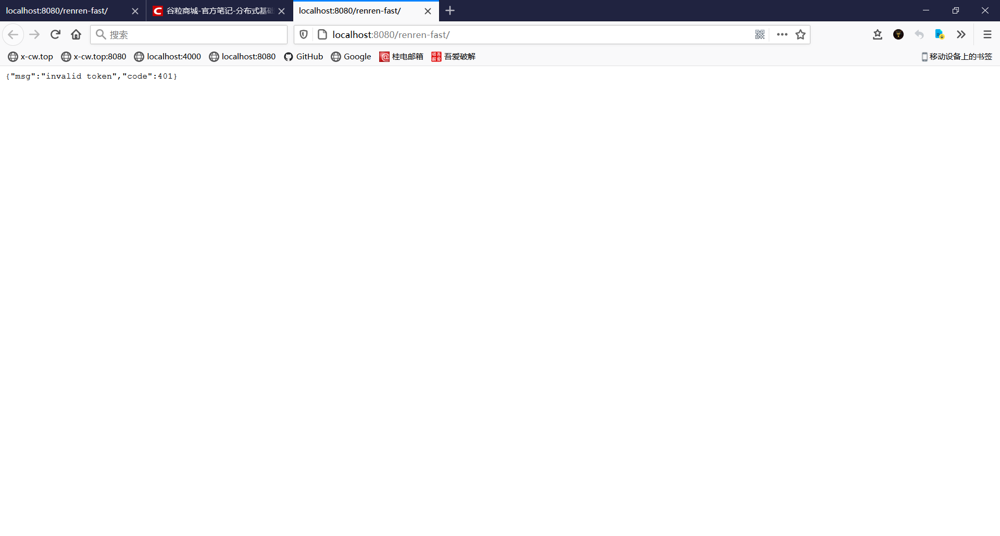

## 配置文件

修改“application-dev.yml”文件，默认为dev环境，修改连接mysql的url和用户名密码

```yaml
spring:
    datasource:
        type: com.alibaba.druid.pool.DruidDataSource
        druid:
            -class-name: com.mysql.cj.jdbc.Driver
            url: jdbc:mysql://192.168.56.10:3306/gulimall_admin?useUnicode=true&characterEncoding=UTF-8&serverTimezone=Asia/Shanghai
            username: root
            password: root
```

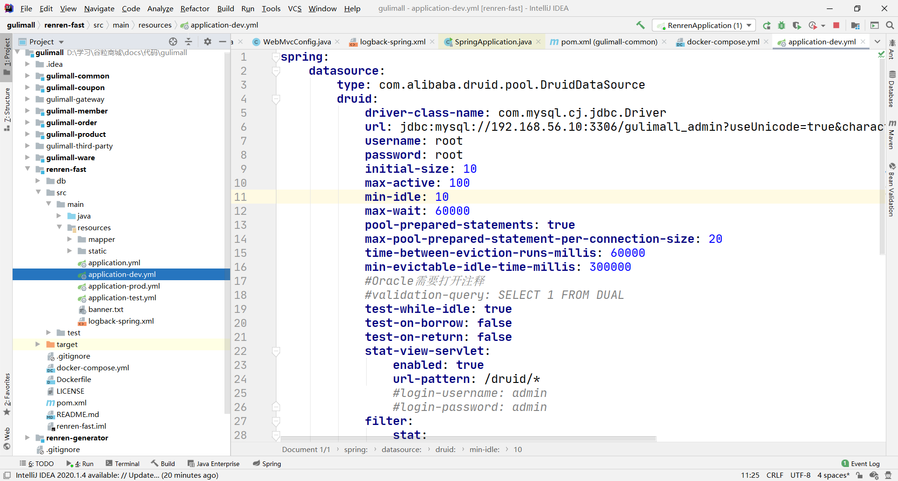

# 2：前后联调

## 安装node-v10.16.3-x64.msi

cmd 运行

```
npm config set registry http://registry.npm.taobao.org/
```

## renren-fast-vue用打开

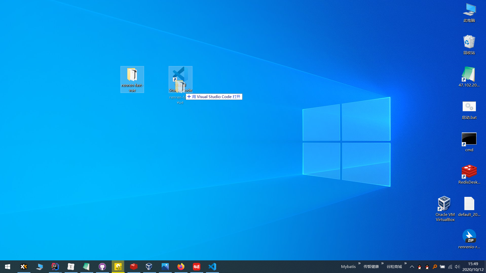

## 终端依次输入

```
npm install
```

```
npm run dev
```

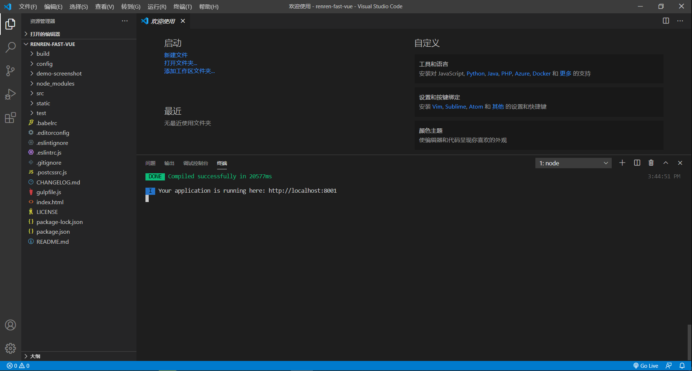

## 运行第一次运行的那个程序

renren-fast-vue 收到的会交给 renren-fast 处理

## 访问

http://localhost:8001/#/login

账号：admin

密码：admin

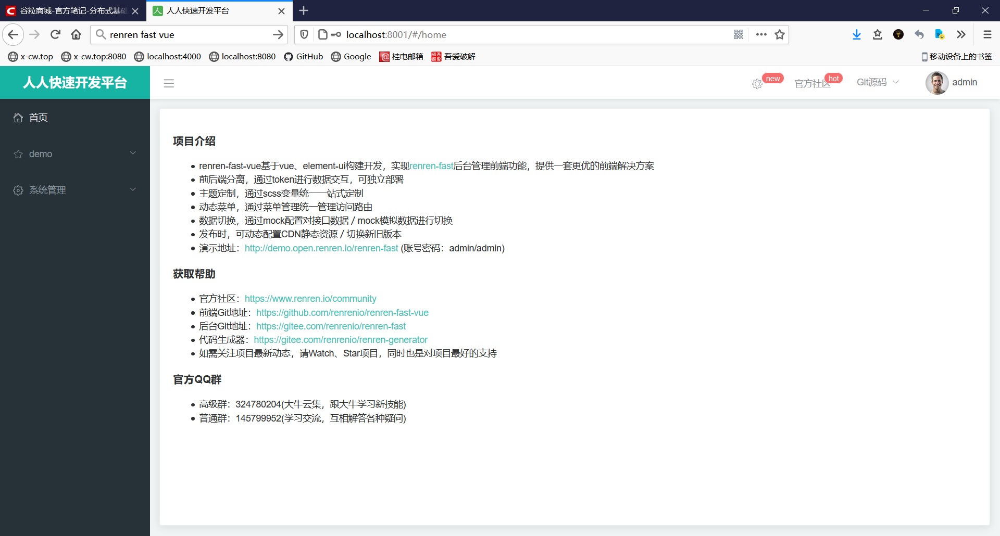


