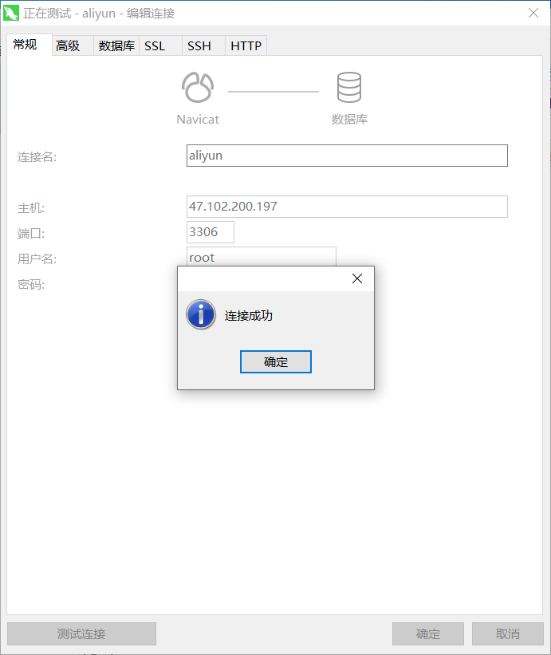

# 安装 docker

```
sudo yum remove docker \
                  docker-client \
                  docker-client-latest \
                  docker-common \
                  docker-latest \
                  docker-latest-logrotate \
                  docker-logrotate \
                  docker-engine
```

```
sudo yum install -y yum-utils
```

```
sudo yum-config-manager \
    --add-repo \
    https://download.docker.com/linux/centos/docker-ce.repo
```

```
sudo yum install docker-ce docker-ce-cli containerd.io -y
```

## 启动

```
sudo systemctl start docker
```

## 成功验证

### 版本查看

```
docker -v
```

### 检查镜像

```
sudo docker images
```

## 开机自启动

```
sudo systemctl enable docker
```

## 加速

```
sudo mkdir -p /etc/docker
sudo tee /etc/docker/daemon.json <<-'EOF'
{
  "registry-mirrors": ["https://6ypv0a1a.mirror.aliyuncs.com"]
}
EOF
sudo systemctl daemon-reload
sudo systemctl restart docker
```

## 安装

### mysql

##### [删除自带 MySQL](https://www.cnblogs.com/hqjy/p/7248680.html)

```
yum remove mysql-community-common-5.7.31-1.el7.x86_64 -y
yum remove mysql57-community-release-el7-10.noarch -y
yum remove mysql-community-libs-5.7.31-1.el7.x86_64 -y
yum remove mysql-community-client-5.7.31-1.el7.x86_64 -y
yum remove mysql-community-server-5.7.31-1.el7.x86_64 -y
yum remove mysql-community-libs-compat-5.7.31-1.el7.x86_64 -y


rm -rf /usr/share/mysql
rm -rf /etc/selinux/targeted/tmp/modules/100/mysql
rm -rf /etc/selinux/targeted/active/modules/100/mysql
rm -rf /var/lib/docker/overlay2/b12c13ecb8bda32eda338e1da77976b949fc9a8aa428efa0608f13b1d84f79eb/diff/usr/lib/mysql
rm -rf /var/lib/docker/overlay2/b12c13ecb8bda32eda338e1da77976b949fc9a8aa428efa0608f13b1d84f79eb/diff/usr/share/mysql
rm -rf /var/lib/docker/overlay2/b12c13ecb8bda32eda338e1da77976b949fc9a8aa428efa0608f13b1d84f79eb/diff/usr/bin/mysql
rm -rf /var/lib/docker/overlay2/b12c13ecb8bda32eda338e1da77976b949fc9a8aa428efa0608f13b1d84f79eb/diff/etc/init.d/mysql
rm -rf /var/lib/docker/overlay2/b12c13ecb8bda32eda338e1da77976b949fc9a8aa428efa0608f13b1d84f79eb/diff/etc/mysql
rm -rf /var/lib/docker/overlay2/b12c13ecb8bda32eda338e1da77976b949fc9a8aa428efa0608f13b1d84f79eb/diff/var/lib/mysql
rm -rf /var/lib/docker/overlay2/b12c13ecb8bda32eda338e1da77976b949fc9a8aa428efa0608f13b1d84f79eb/diff/var/log/mysql
rm -rf /var/lib/mysql
rm -rf /var/lib/mysql/mysql
```

#### 杀死占用 3306 端口的进程

```
sudo fuser -k -n tcp 3306
```

#### 安装

```
sudo docker pull mysql:5.7
```

#### 检查

```
sudo docker images
```

#### 启动

```shell
sudo docker run -p 3306:3306 --name mysql \
-v /mydata/mysql/log:/var/log/mysql \
-v /mydata/mysql/data:/var/lib/mysql \
-v /mydata/mysql/conf:/etc/mysql \
-e MYSQL_ROOT_PASSWORD=root \
-d mysql:5.7
```

#### 查看正在运行

```
sudo docker ps
```

#### 连接测试

